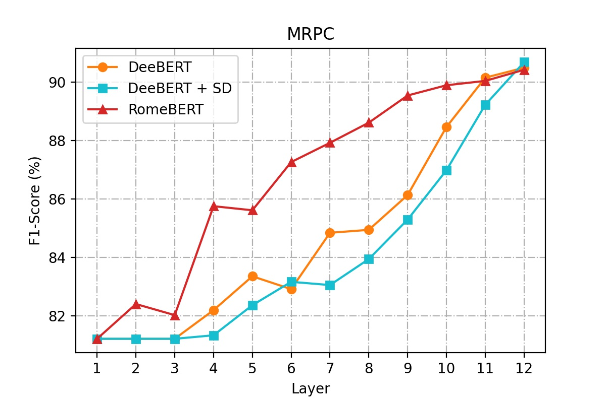
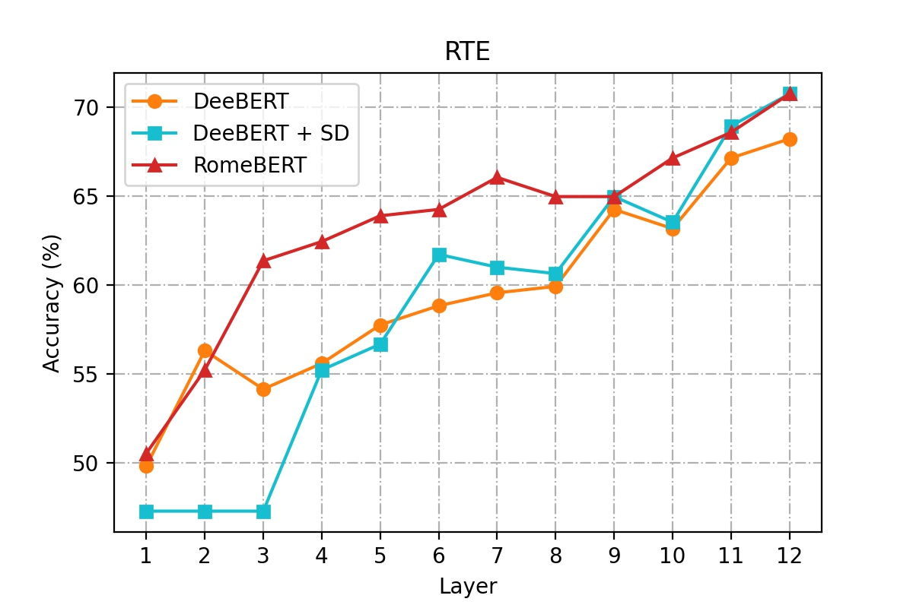
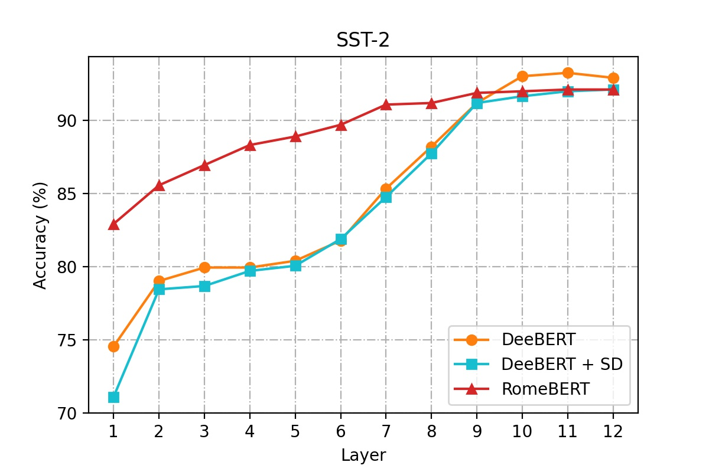
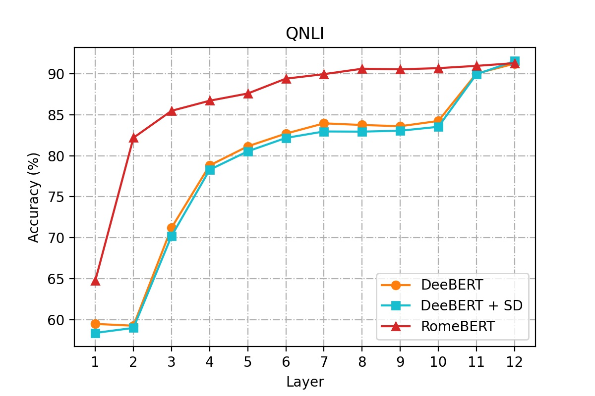
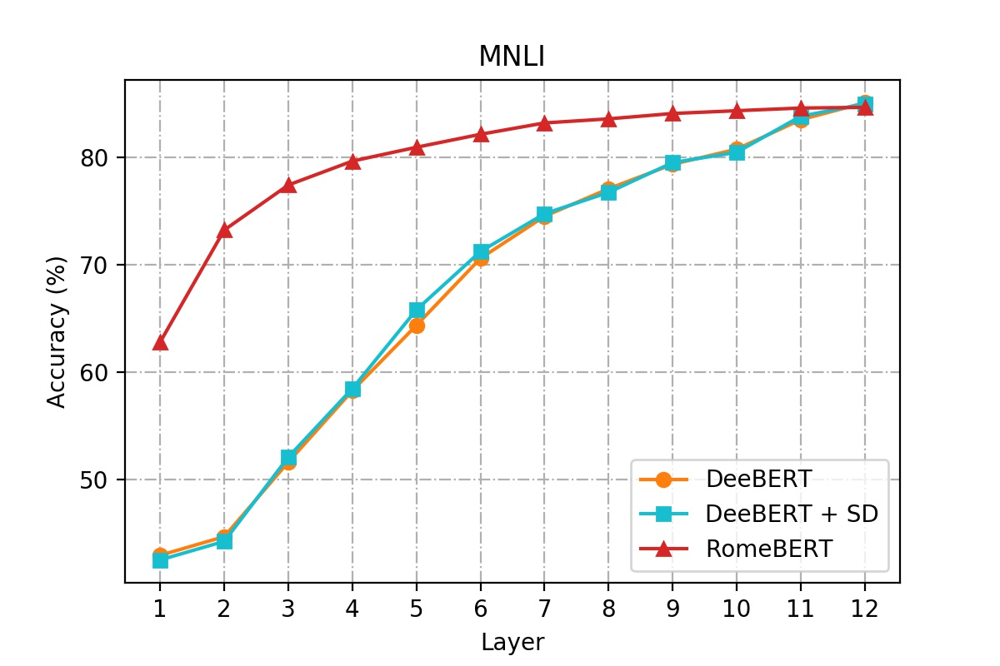
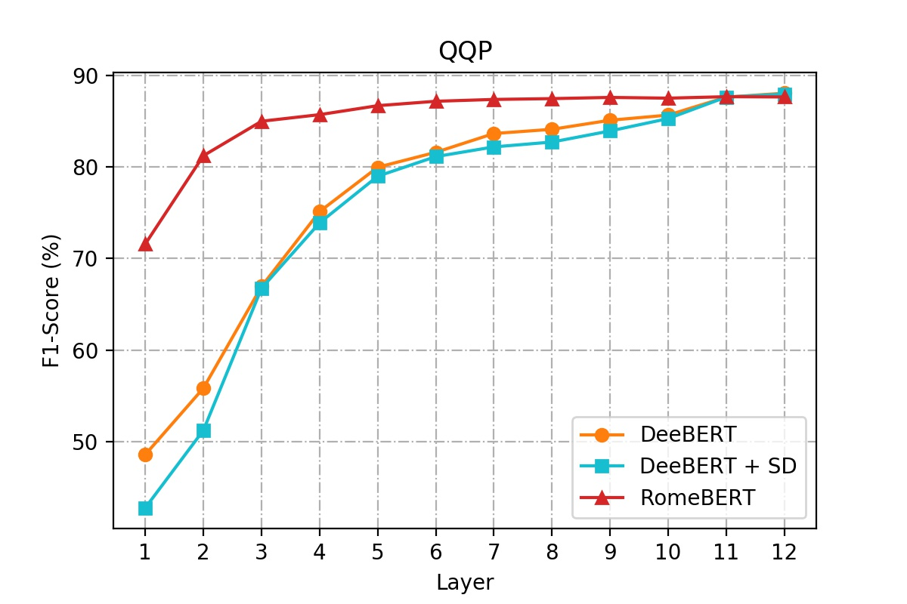

# RomeBERT


## Installation

This repo is tested on Python 3.7.7, PyTorch 1.4.0, and Cuda 10.1. Using a virtulaenv or conda environemnt is recommended, for example:

```
conda install pytorch==1.4.0 torchvision cudatoolkit=10.1 -c pytorch
```

After installing the required environment and cloning this repo, install the following requirements:

```
pip install -r ./requirements.txt
pip install -r ./examples/requirements.txt
```

Download GLUE dataset by

```
python download_glue_data.py --data_dir data --tasks all
```

## Comparison with DeeBERT & DeeBERT+SD














## Usage

### RomeBERT - SD only

Scripts are in the `scripts` folder, which corresponds to `RomeBERT - SD only`. 


#### train_high.sh

This is for fine-tuning `RomeBERT - SD only` models.

#### eval_high_layer.sh

This is for evaluating each exit layer for fine-tuned `RomeBERT - SD only` models.

#### eval_high_entropy.sh

This is for evaluating fine-tuned `RomeBERT - SD only` models, given a number of different early exit entropy thresholds.

#### test_sd.sh

This is for creating output tsv file for test split for fine-tuned `RomeBERT - SD only` models.


### RomeBERT - SD + GR

Scripts are in the `new_scripts` folder, which corresponds to `RomeBERT - SD+GR`. 


#### train_high.sh

This is for fine-tuning `RomeBERT - SD+GR` models.

#### eval_high_layer.sh

This is for evaluating each exit layer for fine-tuned `RomeBERT - SD+GR` models.

#### eval_high_entropy.sh

This is for evaluating fine-tuned `RomeBERT - SD+GR` models, given a number of different early exit entropy thresholds.

#### test_sd+gr.sh

This is for creating output tsv file for test split for fine-tuned `RomeBERT - SD+GR` models.

